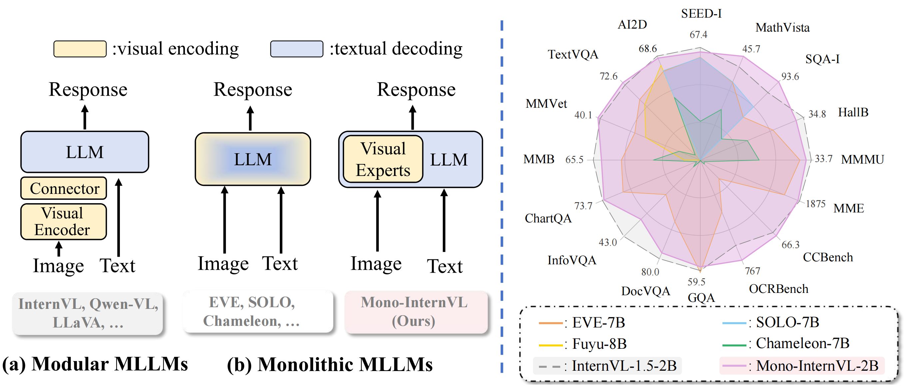
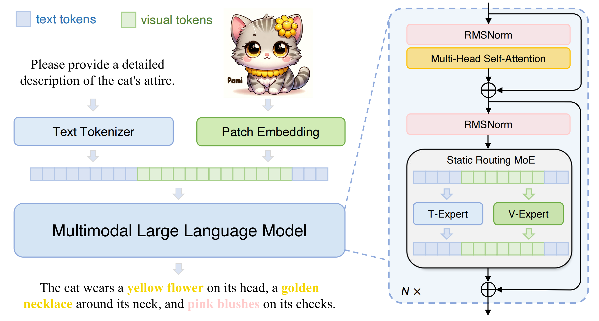

# Mono-InternVL: Pushing the Boundaries of Monolithic Multimodal Large Language Models with Endogenous Visual Pre-training

[[⭐️Project Page]](https://internvl.github.io/blog/2024-10-10-Mono-InternVL/) [[🤗 Models]](https://huggingface.co/collections/OpenGVLab/mono-internvl-6707cb402afb22f1e29f4d2b) [[📜 Mono-InternVL Paper]](https://arxiv.org/abs/2410.08202) [[📝 Chinese Post]](https://mp.weixin.qq.com/s/FmjG0Gp5ow7mm2Vzd9ppPg)

<a id="radar"></a>

<p align="center">



</p>

## 📰 News
- **2025.3**: We release the SFT code on LLaVA-v1.5-mix665k dataset.
- **2025.2**: 🎉🎉 Mono-InternVL is accepted by **CVPR 2025**.
- **2024.11**: Mono-InternVL is supported by [lmdeploy](https://github.com/InternLM/lmdeploy/pull/2727).
- **2024.11**: Mono-InternVL is supported by [vllm](https://github.com/vllm-project/vllm/pull/9528).


## ⭐️ Introduction

We release Mono-InternVL, a **monolithic** multimodal large language model (MLLM) that integrates visual encoding and textual decoding into a single LLM. In Mono-InternVL, a set of visual experts is embedded into the pre-trained LLM via a **mixture-of-experts (MoE) mechanism**. By freezing the LLM, Mono-InternVL ensures that visual capabilities are optimized without compromising the pre-trained language knowledge. Based on this structure, an innovative **Endogenous Visual Pretraining (EViP)** is introduced to realize coarse-to-fine visual learning.


Mono-InternVL achieves superior performance compared to state-of-the-art MLLM Mini-InternVL-2B-1.5 and significantly outperforms other monolithic MLLMs, as shown in the [radar chart](#radar) above. Meanwhile, it achieves better deployment efficiency, with first token latency reduced by up to 67%.


For more details, please refer to our [paper](https://arxiv.org/abs/2410.08202).


## 📊 Performance
|          Benchmark           | Chameleon-7B | EVE-7B (HD) |    Emu3    | Mini-InternVL-2B-1-5 | Mono-InternVL-2B |
| :--------------------------: | :----------: | :---------: | :--------: | :------------------: | :--------------: |
|             Type             |  Monolithic  | Monolithic  | Monolithic |       Modular        |    Monolithic    |
|      #Activated Params       |      7B      |     7B      |     8B     |         2.2B         |       1.8B       |
|                              |              |             |            |                      |                  |
|            MMVet             |     8.3      |    25.7     |    37.2    |         39.3         |       40.1       |
|      MMMU<sub>val</sub>      |     25.4     |    32.6     |    31.6    |         34.6         |       33.7       |
|      MME<sub>sum</sub>       |     170      |    1628     |     —      |         1902         |       1875       |
|  MMBench-EN<sub>test</sub>   |     31.1     |    52.3     |    58.5    |         70.9         |       65.5       |
| MathVista<sub>testmini</sub> |     22.3     |    34.2     |     —      |         41.1         |       45.7       |
|          SEED-Image          |     30.6     |    64.6     |    68.2    |         69.8         |       67.4       |
|           OCRBench           |      7       |     398     |    687     |         654          |       767        |
|       Hallusion-Bench        |     17.1     |    26.4     |     —      |         37.5         |       34.8       |
|    CCBench<sub>dev</sub>     |     3.5      |    16.3     |     —      |         63.5         |       66.3       |
|   Avg<sub>multimodal</sub>   |     16.1     |    38.9     |     —      |         54.4         |       55.2       |
|                              |              |             |            |                      |                  |
|    TextVQA<sub>val</sub>     |     4.8      |    56.8     |    64.7    |         70.5         |       72.6       |
|     SQA-I<sub>test</sub>     |     47.2     |    64.9     |    89.2    |         84.9         |       93.6       |
|      GQA<sub>test</sub>      |      —       |    62.6     |    60.3    |         61.6         |       59.5       |
|    DocVQA<sub>test</sub>     |     1.5      |    53.0     |    76.3    |         85.0         |       80.0       |
|     AI2D<sub>test</sub>      |     46.0     |    61.0     |    70.0    |         69.8         |       68.6       |
|    ChartQA<sub>test</sub>    |     2.9      |    59.1     |    68.6    |         74.8         |       73.7       |
|    InfoVQA<sub>test</sub>    |     5.0      |    25.0     |    43.8    |         55.4         |       43.0       |
|      Avg<sub>VQA</sub>       |     17.9     |    54.6     |    67.6    |         71.7         |       70.1       |

> * Sources of the results include the original papers, our evaluation with [VLMEvalKit](https://github.com/open-compass/VLMEvalKit), and [OpenCompass](https://rank.opencompass.org.cn/leaderboard-multimodal/?m=REALTIME).
> * Average scores are computed by normalizing each metric to a range between 0 and 100.
> * Please note that evaluating the same model using different testing toolkits can result in slight differences, which is normal. Updates to code versions and variations in environment and hardware can also cause minor discrepancies in results.


## 🚀 Inference

We provide an example code to run Mono-InternVL-2B inference using `transformers`.

> Please use transformers==4.37.2 to ensure the model works normally.

<details>
<summary>Inference with Transformers (click to expand)</summary>

```python
import numpy as np
import torch
import torchvision.transforms as T
from decord import VideoReader, cpu
from PIL import Image
from torchvision.transforms.functional import InterpolationMode
from transformers import AutoModel, AutoTokenizer

IMAGENET_MEAN = (0.485, 0.456, 0.406)
IMAGENET_STD = (0.229, 0.224, 0.225)

def build_transform(input_size):
    MEAN, STD = IMAGENET_MEAN, IMAGENET_STD
    transform = T.Compose([
        T.Lambda(lambda img: img.convert('RGB') if img.mode != 'RGB' else img),
        T.Resize((input_size, input_size), interpolation=InterpolationMode.BICUBIC),
        T.ToTensor(),
        T.Normalize(mean=MEAN, std=STD)
    ])
    return transform

def find_closest_aspect_ratio(aspect_ratio, target_ratios, width, height, image_size):
    best_ratio_diff = float('inf')
    best_ratio = (1, 1)
    area = width * height
    for ratio in target_ratios:
        target_aspect_ratio = ratio[0] / ratio[1]
        ratio_diff = abs(aspect_ratio - target_aspect_ratio)
        if ratio_diff < best_ratio_diff:
            best_ratio_diff = ratio_diff
            best_ratio = ratio
        elif ratio_diff == best_ratio_diff:
            if area > 0.5 * image_size * image_size * ratio[0] * ratio[1]:
                best_ratio = ratio
    return best_ratio

def dynamic_preprocess(image, min_num=1, max_num=12, image_size=448, use_thumbnail=False):
    orig_width, orig_height = image.size
    aspect_ratio = orig_width / orig_height

    # calculate the existing image aspect ratio
    target_ratios = set(
        (i, j) for n in range(min_num, max_num + 1) for i in range(1, n + 1) for j in range(1, n + 1) if
        i * j <= max_num and i * j >= min_num)
    target_ratios = sorted(target_ratios, key=lambda x: x[0] * x[1])

    # find the closest aspect ratio to the target
    target_aspect_ratio = find_closest_aspect_ratio(
        aspect_ratio, target_ratios, orig_width, orig_height, image_size)

    # calculate the target width and height
    target_width = image_size * target_aspect_ratio[0]
    target_height = image_size * target_aspect_ratio[1]
    blocks = target_aspect_ratio[0] * target_aspect_ratio[1]

    # resize the image
    resized_img = image.resize((target_width, target_height))
    processed_images = []
    for i in range(blocks):
        box = (
            (i % (target_width // image_size)) * image_size,
            (i // (target_width // image_size)) * image_size,
            ((i % (target_width // image_size)) + 1) * image_size,
            ((i // (target_width // image_size)) + 1) * image_size
        )
        # split the image
        split_img = resized_img.crop(box)
        processed_images.append(split_img)
    assert len(processed_images) == blocks
    if use_thumbnail and len(processed_images) != 1:
        thumbnail_img = image.resize((image_size, image_size))
        processed_images.append(thumbnail_img)
    return processed_images

def load_image(image_file, input_size=448, max_num=12):
    image = Image.open(image_file).convert('RGB')
    transform = build_transform(input_size=input_size)
    images = dynamic_preprocess(image, image_size=input_size, use_thumbnail=True, max_num=max_num)
    pixel_values = [transform(image) for image in images]
    pixel_values = torch.stack(pixel_values)
    return pixel_values


path = 'OpenGVLab/Mono-InternVL-2B'
model = AutoModel.from_pretrained(
    path,
    torch_dtype=torch.bfloat16,
    low_cpu_mem_usage=True,
    trust_remote_code=True).eval().cuda()
tokenizer = AutoTokenizer.from_pretrained(path, trust_remote_code=True, use_fast=False)

# set the max number of tiles in `max_num`
pixel_values = load_image('./examples/image1.jpg', max_num=12).to(torch.bfloat16).cuda()
generation_config = dict(max_new_tokens=1024, do_sample=True)

# pure-text conversation
question = 'Hello, who are you?'
response, history = model.chat(tokenizer, None, question, generation_config, history=None, return_history=True)
print(f'User: {question}\nAssistant: {response}')

question = 'Can you tell me a story?'
response, history = model.chat(tokenizer, None, question, generation_config, history=history, return_history=True)
print(f'User: {question}\nAssistant: {response}')

# single-image single-round conversation
question = '<image>\nPlease describe the image shortly.'
response = model.chat(tokenizer, pixel_values, question, generation_config)
print(f'User: {question}\nAssistant: {response}')

# single-image multi-round conversation
question = '<image>\nPlease describe the image in detail.'
response, history = model.chat(tokenizer, pixel_values, question, generation_config, history=None, return_history=True)
print(f'User: {question}\nAssistant: {response}')

question = 'Please write a poem according to the image.'
response, history = model.chat(tokenizer, pixel_values, question, generation_config, history=history, return_history=True)
print(f'User: {question}\nAssistant: {response}')
```

</details>


<details>
<summary>Inference with LMDeploy</summary>

Please install lmdeploy>=0.6.3 for Mono-InternVL support.

```python
from lmdeploy import pipeline
from lmdeploy.vl import load_image

image = load_image('./examples/image1.jpg')
pipe = pipeline('OpenGVLab/Mono-InternVL-2B')
response = pipe(('Please describe the image shortly.', image))
print(response.text)
```
</details>

## 🔥 Supervised Finetuning

Currently we provide the supervised finetuning (S2 instruction tuning) code on the LLaVA-v1.5-mix665k dataset. For details on the dataset, please refer to [LLaVA-v1.5](https://github.com/haotian-liu/LLaVA).

<details>
<summary>Installation</summary>

- Clone this repository:

  ```bash
  git clone https://github.com/OpenGVLab/Mono-InternVL.git
  ```
  
- Create a conda virtual environment and activate it:

  ```bash
  conda create -n monointernvl python=3.9 -y
  conda activate monointernvl
  ```

- Install dependencies using `requirements.txt`:

  ```bash
  pip install -r requirements.txt
  ```

- Additional: Install `flash-attn==2.5.6`:

  ```bash
  pip install flash-attn==2.5.6 --no-build-isolation
  ```

  Alternatively you can compile from source:

  ```bash
  git clone https://github.com/Dao-AILab/flash-attention.git
  cd flash-attention
  git checkout v2.5.6
  python setup.py install
  ```
</details>

<details>
<summary>Training Dataset Preparation</summary>


1. Download instruction tuning data:
```sh
mkdir playground
wget https://huggingface.co/datasets/liuhaotian/LLaVA-Instruct-150K/resolve/main/llava_v1_5_mix665k.json -P playground/
```

1. Download image datasets:

- COCO: [train2017](http://images.cocodataset.org/zips/train2017.zip)
- GQA: [images](https://downloads.cs.stanford.edu/nlp/data/gqa/images.zip)
- OCR-VQA: [download script](https://drive.google.com/drive/folders/1_GYPY5UkUy7HIcR0zq3ZCFgeZN7BAfm_?usp=sharing)
- TextVQA: [train_val_images](https://dl.fbaipublicfiles.com/textvqa/images/train_val_images.zip)
- VisualGenome: [part1](https://cs.stanford.edu/people/rak248/VG_100K_2/images.zip), [part2](https://cs.stanford.edu/people/rak248/VG_100K_2/images2.zip)
  
Organize the data as follows:

```none
playground/
├── data/
│   ├── coco/train2017/
│   ├── gqa/images/
│   ├── ocr_vqa/images/
│   ├── textvqa/train_images/
│   └── vg/
│       ├── VG_100K/
│       └── VG_100K_2/
└── llava_v1_5_mix665k.json
```
</details>

<details>
<summary>Model Preparation</summary>

Our models are built from Mono-InternVL series. 
Choose from the following model versions and download the weights to `workdirs/` folder.


| model name              | download                                                               |  size  |
| ----------------------- | ---------------------------------------------------------------------- |:------:|
| Mono-InternVL-2B-S1-1   | 🤗 [HF link](https://huggingface.co/OpenGVLab/Mono-InternVL-2B-S1-1) | 6.2 GB |
| Mono-InternVL-2B-S1-2   | 🤗 [HF link](https://huggingface.co/OpenGVLab/Mono-InternVL-2B-S1-2) | 6.2 GB |
| Mono-InternVL-2B-S1-3   | 🤗 [HF link](https://huggingface.co/OpenGVLab/Mono-InternVL-2B-S1-3) | 6.2 GB |


```sh
mkdir workdirs
cd workdirs/
# pip install -U huggingface_hub
huggingface-cli download --resume-download --local-dir-use-symlinks False OpenGVLab/Mono-InternVL-2B-S1-1 --local-dir Mono-InternVL-2B-S1-1
```

The directory structure is:

```sh
workdirs/
├── Mono-InternVL-2B-S1.1/
├── Mono-InternVL-2B-S1.2/
└── Mono-InternVL-2B-S1.3/
```
</details>

<details>
<summary>Training</summary>

You can use 8 GPUs to finetune the model, and it will take approximately 12 hours.

#### Slurm Cluster
```sh
# using 8 GPUs
PARTITION='your partition' sh shell/internlm2ve_1_8b_dynamic/Mono_internvl_dynamic_res_finetune_llava.sh
```
#### Single Node Multi-GPU
```sh
sh internlm2ve_1_8b_dynamic/Mono_internvl_dynamic_res_finetune_llava_torchrun.sh
```

</details>


## 🎫 License

This project is released under the [MIT License](LICENSE).

## 🖊️ Citation

If you find this work helpful in your research, please consider giving this repo a star ⭐ and citing our paper:

```bibtex
@article{luo2024mono,
  title={Mono-InternVL: Pushing the Boundaries of Monolithic Multimodal Large Language Models with Endogenous Visual Pre-training},
  author={Luo, Gen and Yang, Xue and Dou, Wenhan and Wang, Zhaokai and Liu, Jiawen and Dai, Jifeng and Qiao, Yu and Zhu, Xizhou},
  journal={arXiv preprint arXiv:2410.08202},
  year={2024}
}
```
